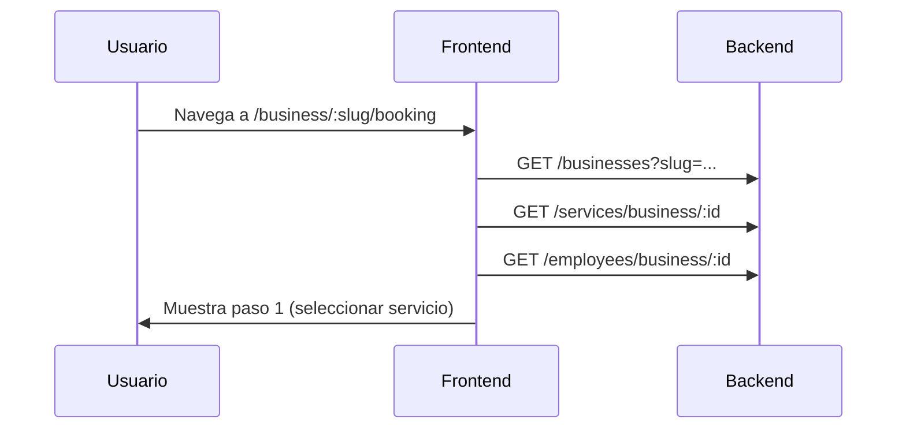
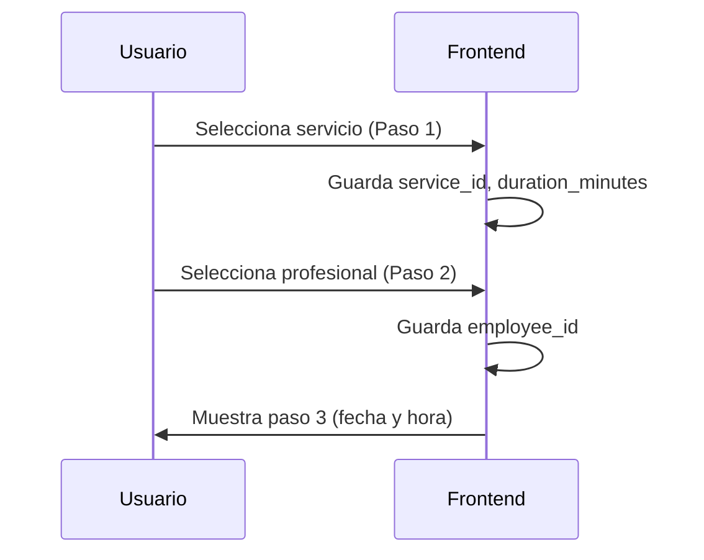
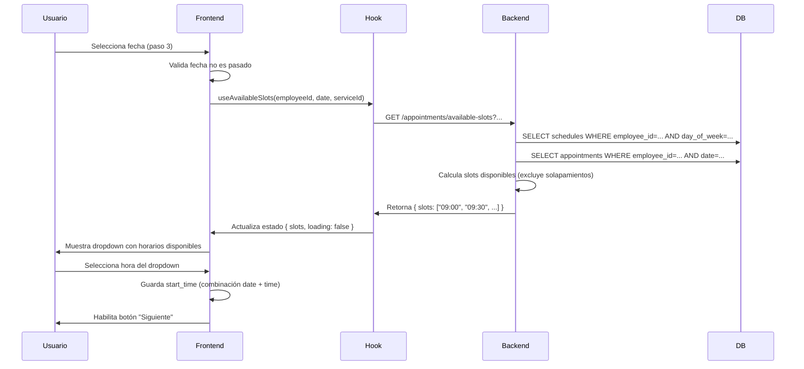
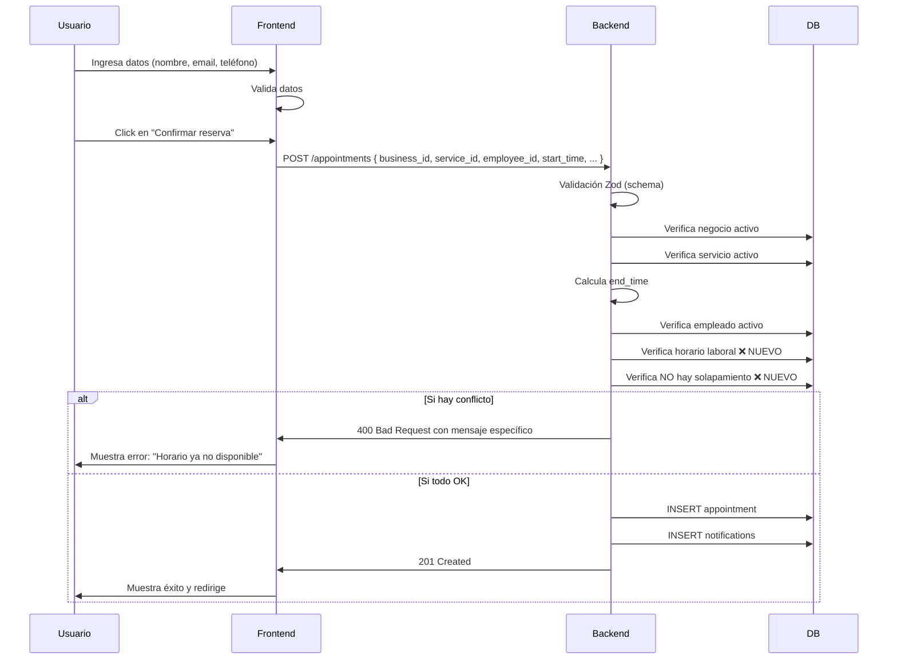

# 📅 Validación de Disponibilidad de Horarios - Implementación Completa

## 📋 Resumen Ejecutivo

Se ha implementado un sistema completo de validación de disponibilidad de horarios para el flujo de reserva de citas en Turnito. El sistema valida disponibilidad tanto en frontend (experiencia de usuario mejorada) como en backend (seguridad y consistencia de datos).

**Fecha de implementación**: 08 de Agosto de 2026  
**Versión**: 1.0  
**Estado**: ✅ Completada

---

## 🎯 Objetivos Alcanzados

✅ Usuarios no pueden seleccionar horarios no disponibles  
✅ Sistema valida horario laboral del profesional  
✅ Sistema previene solapamiento de citas  
✅ Duración del servicio se considera en cálculo de disponibilidad  
✅ Frontend obtiene y muestra solo horarios disponibles  
✅ Backend rechaza intentos de crear citas no disponibles  
✅ Manejo de race conditions (si horario se reserva mientras usuario está en pantalla)  
✅ Mensajes claros al usuario cuando horario no está disponible  
✅ Suite completa de tests para validación  

---

## 📁 Archivos Modificados

### Backend

#### 1. **`src/modules/appointments/appointment.service.js`**
   - ✨ **Nuevo**: Método público `getServiceDuration(serviceId)`
     - Obtiene duración del servicio para cálculo de slots
   
   - ✨ **Nuevo**: Método público `checkAvailability(employeeId, startTime, endTime)`
     - Verifica disponibilidad de un horario específico
     - Retorna: `{ available: boolean, reason?: string }`
     - Valida horario laboral Y ausencia de solapamientos
   
   - ✨ **Nuevo**: Método público `getAvailableSlots(employeeId, date, durationMin, slotDuration=30)`
     - Obtiene array de horarios disponibles en una fecha
     - Parámetros:
       - `employeeId`: UUID del profesional
       - `date`: Formato "YYYY-MM-DD"
       - `durationMin`: Duración del servicio en minutos
       - `slotDuration`: Intervalo de slots (default 30 min)
     - Retorna: `{ date, slots: ["09:00", "09:30", ...], timezone: "UTC" }`
   
   - 🔴 **Cambio crítico**: Comportamiento de `create()` ahora es **ESTRICTO**
     - Antes: Si empleado no disponible → cita creada con `employee_id = null`
     - Ahora: Si empleado no disponible → **Rechaza con ApiError.badRequest()**
     - Mensajes específicos según tipo de error:
       - "El profesional seleccionado no está disponible."
       - "El horario solicitado está fuera del horario de trabajo del profesional."
       - "El horario seleccionado ya no está disponible. Puede haber sido reservado recientemente."

#### 2. **`src/modules/appointments/appointment.controller.js`**
   - ✨ **Nuevo**: Método `getAvailableSlots`
     - Handler para endpoint GET /appointments/available-slots
     - Valida query params: employeeId, date, serviceId, slotDuration
     - Llamada al servicio y respuesta HTTP

#### 3. **`src/modules/appointments/appointment.routes.js`**
   - ✨ **Nueva ruta**: `GET /appointments/available-slots`
     - **Acceso**: Público (sin autenticación)
     - **Query params**:
       - `employeeId` (UUID, requerido)
       - `date` (YYYY-MM-DD, requerido)
       - `serviceId` (UUID, requerido)
       - `slotDuration` (number, optional, default 30)
     - **Validación**: Zod schema para validar parámetros
     - **Respuesta**:
       ```json
       {
         "success": true,
         "message": "Horarios disponibles obtenidos correctamente.",
         "data": {
           "date": "2026-08-20",
           "slots": ["09:00", "09:30", "10:00", "10:30", ...],
           "timezone": "UTC"
         }
       }
       ```

#### 4. **`src/modules/appointments/appointment.test.js`**
   - ✨ **Nuevo**: Suite de tests completa (12 casos de prueba)
     - Cobertura de todos los escenarios de solapamiento
     - Tests de validación de jornada laboral
     - Tests de race conditions
     - Tests de integración con endpoint

### Frontend

#### 5. **`frontend/src/hooks/useAvailableSlots.js`**
   - ✨ **Nuevo**: Custom hook React para obtener horarios disponibles
   - Parámetros:
     - `employeeId` (UUID del profesional)
     - `date` (fecha en formato YYYY-MM-DD)
     - `serviceId` (UUID del servicio)
     - `slotDuration` (intervalo en minutos, default 30)
   - Retorna:
     ```javascript
     {
       slots: ["09:00", "09:30", ...],  // Array de horarios disponibles
       loading: boolean,                 // Está cargando
       error: string | null,             // Mensaje de error
       refetch: () => void               // Función para recargar
     }
     ```
   - Características:
     - Fetch automático cuando parámetros cambian
     - Manejo de errores y estados de carga
     - Limpia automáticamente cuando faltan parámetros

#### 6. **`frontend/src/pages/client/booking/StepDateTime.jsx`**
   - 🔄 **Refactorizado completamente**
   - Ahora usa `useAvailableSlots` hook
   - Reemplaza input de hora por dropdown dinámico
   - Características:
     - Muestra solo horarios disponibles
     - Indicador de carga mientras se obtienen horarios
     - Mensaje de error si no hay disponibilidad
     - Contador de horarios disponibles
     - Validación: fecha debe ser seleccionada primero
     - Limpia hora cuando cambia la fecha
   - Props nuevos:
     - `employeeId` (UUID del profesional seleccionado)
     - `serviceId` (UUID del servicio seleccionado)

#### 7. **`frontend/src/pages/client/BookingPage.jsx`**
   - Actualización mínima: Pasar `employeeId` y `serviceId` a StepDateTime
   - No hay cambios en lógica principal
   - Compatible con flujo existente

---

## 🔧 Lógica de Disponibilidad Implementada

### Fórmula de Solapamiento

```javascript
// Dos periodos se solapan si y solo si:
SOLAPA = (newStart < existingEnd) AND (newEnd > existingStart)

// Ejemplos:
Existente: 10:00 - 11:00

// ✅ NO SOLAPA
10:00 - 11:00 antes (9:00 - 10:00)    → newEnd (10:00) NOT > existingStart (10:00) ✗
10:00 - 11:00 después (11:00 - 12:00) → newStart (11:00) NOT < existingEnd (11:00) ✗

// ❌ SOLAPA
10:00 - 11:00 igual (10:00 - 11:00)   → newStart < newEnd ✓ AND newEnd > newStart ✓
10:00 - 11:00 dentro (10:15 - 10:45)  → 10:15 < 11:00 ✓ AND 10:45 > 10:00 ✓
10:00 - 11:00 engloba (09:30 - 11:30) → 09:30 < 11:00 ✓ AND 11:30 > 10:00 ✓
10:00 - 11:00 inicio (10:30 - 11:30)  → 10:30 < 11:00 ✓ AND 11:30 > 10:00 ✓
10:00 - 11:00 fin (09:30 - 10:30)     → 09:30 < 11:00 ✓ AND 10:30 > 10:00 ✓
```

### Algoritmo de Obtención de Slots

```
1. Obtener horarios laborales del empleado para el día (day_of_week)
2. Obtener citas existentes del empleado para esa fecha (status != 'cancelled')
3. Generar slots posibles dentro de cada horario laboral:
   - Inicio: start_time del horario
   - Intervalo: cada 30 minutos (configurable)
   - Fin: hasta que start_time + duration <= end_time
4. Filtrar slots que se solapan con citas existentes
5. Retornar array de slots disponibles
```

### Validación al Crear Cita

```
1. ✅ Verificar fecha no es en el pasado
2. ✅ Verificar negocio existe y está activo
3. ✅ Verificar servicio existe y está activo (obtener duration_minutes)
4. ✅ Calcular end_time = start_time + duration_minutes
5. ✅ SI employee_id proporcionado:
   a. ✅ Verificar empleado existe y está activo
   b. ✅ Verificar start_time Y end_time dentro de horario laboral
   c. ✅ Verificar NO hay solapamiento con citas existentes
   d. ❌ SI alguna validación falla → RECHAZAR con mensaje específico
6. ✅ Insertar cita
7. ✅ Crear notificaciones
8. ✅ Loguear evento
```

---

## 🌍 Flujo End-to-End

### 1. **Cliente Inicia Reserva**



### 2. **Cliente Selecciona Servicio y Profesional**



### 3. **Cliente Selecciona Fecha y Hora** ⭐ NUEVO



### 4. **Cliente Confirma Reserva**



---

## 🛡️ Casos de Uso y Validaciones

### Caso 1: Horario Disponible
```
Empleado: lunes-viernes 09:00-17:00
Citas: ninguna
Usuario intenta: jueves 10:00-11:00 (servicio 60 min)

✅ RESULTADO: Cita creada exitosamente
```

### Caso 2: Horario Ocupado
```
Empleado: lunes-viernes 09:00-17:00
Citas: jueves 10:00-11:00
Usuario intenta: jueves 10:30-11:30 (servicio 60 min)

❌ RESULTADO: Error - "El horario seleccionado ya no está disponible"
```

### Caso 3: Fuera de Horario Laboral
```
Empleado: lunes-viernes 09:00-17:00
Usuario intenta: jueves 08:00-09:00 (servicio 60 min)

❌ RESULTADO: Error - "El horario está fuera del horario de trabajo"
```

### Caso 4: Sin Empleado Disponible Ese Día
```
Empleado: lunes-viernes (no trabaja sábados)
Usuario intenta: sábado 10:00-11:00

❌ RESULTADO: Error - horario laboral no encontrado
```

### Caso 5: Race Condition
```
Tiempo T1: Cliente A obtiene slots disponibles → ["10:00", "10:30"]
Tiempo T2: Cliente B crea cita a las 10:00
Tiempo T3: Cliente A intenta crear cita a las 10:00

❌ RESULTADO: Error - "El horario seleccionado ya no está disponible"
(Backend valida nuevamente justo antes de insertar)
```

---

## 📊 Estructura de Base de Datos

### Tablas Utilizadas

```sql
-- Horarios laborales del empleado
schedules
├── employee_id (FK → employees)
├── day_of_week (0-6, donde 0=domingo)
├── start_time (TIME)
├── end_time (TIME)
└── is_active (boolean)

-- Citas existentes
appointments
├── employee_id (FK → employees, nullable)
├── start_time (TIMESTAMPTZ)
├── end_time (TIMESTAMPTZ)
├── status (enum: pending, confirmed, cancelled, completed, no_show)
└── ... (otros campos)

-- Servicios con duración
services
├── duration_minutes (integer)
├── is_active (boolean)
└── ... (otros campos)

-- Empleados
employees
├── business_id (FK → businesses)
├── is_active (boolean)
└── ... (otros campos)
```

### Constraint de Exclusión (PostgreSQL)

```sql
-- Previene solapamiento a nivel de base de datos
ALTER TABLE appointments
ADD CONSTRAINT appointments_no_employee_overlap
EXCLUDE USING gist (
  employee_id WITH =,
  tstzrange(start_time, end_time) WITH &&
) WHERE (status != 'cancelled');
```

---

## 🧪 Tests Incluidos

### Archivo: `src/modules/appointments/appointment.test.js`

Incluye pruebas para 12 casos críticos:

1. ✅ Horario completamente disponible
2. ❌ Horario completamente ocupado
3. ❌ Nueva cita comienza durante existente
4. ❌ Nueva cita termina durante existente
5. ❌ Nueva cita engloba existente
6. ❌ Cita con exactamente el mismo horario
7. ✅ Cita inmediatamente antes de otra
8. ✅ Cita inmediatamente después de otra
9. ✅ Duración del servicio respetada
10. ❌ Horario fuera de jornada laboral
11. ❌ Profesional sin disponibilidad ese día
12. ❌ Race condition (horario reservado mientras usuario está en pantalla)

### Cómo ejecutar tests

```bash
npm run test                          # Ejecutar todos los tests
npm run test appointment.test.js      # Tests de appointments
npm run test -- --coverage           # Con reporte de cobertura
```

---

## 📝 Mensajes de Error al Usuario

Cuando el usuario intenta reservar y hay un conflicto:

| Escenario | Mensaje |
|-----------|---------|
| Empleado inactivo | "El profesional seleccionado no está disponible." |
| Fuera de horario laboral | "El horario solicitado está fuera del horario de trabajo del profesional. Selecciona otro horario." |
| Cita solapada | "El horario seleccionado ya no está disponible. Puede haber sido reservado recientemente. Intenta con otro horario." |
| Error temporal | "Error al obtener horarios disponibles" (en frontend) |
| Parámetros faltantes | "Se requieren employeeId, date y serviceId" |

---

## 🚀 Performance y Optimizaciones

### Queries Optimizadas

```sql
-- Obtener horarios laborales: índice en (employee_id, day_of_week)
SELECT * FROM schedules 
WHERE employee_id = $1 AND day_of_week = $2 AND is_active = true;

-- Obtener citas del día: índice en (employee_id, start_time)
SELECT * FROM appointments 
WHERE employee_id = $1 
  AND start_time >= $2 AND start_time <= $3
  AND status != 'cancelled';
```

### Caché en Frontend

El hook `useAvailableSlots` solo refetch cuando:
- `employeeId` cambia
- `date` cambia
- `serviceId` cambia
- `slotDuration` cambia

No hace request repetidas si parámetros no cambian.

### Límites Sugeridos

- **Slots por día**: máximo 48 (cada 30 min × 16 horas)
- **Búsqueda histórica**: máximo 90 días hacia el futuro
- **Intervalo de slots**: mínimo 15 min, máximo 60 min

---

## 🔐 Seguridad

### Validaciones en Capas

1. **Frontend (UX)**
   - Dropdown solo muestra horarios válidos
   - No permite enviar horario inválido al servidor

2. **Backend (CRÍTICO)**
   - Zod schema valida entrada
   - Verifica nuevamente disponibilidad justo antes de insertar
   - Constraint de exclusión en DB previene solapamiento físico

### Protección contra Race Conditions

El sistema está protegido contra race conditions gracias a:

1. **Validación pre-insert**: Se verifica disponibilidad justo antes de `INSERT`
2. **Constraint de exclusión**: PostgreSQL lo valida atómicamente
3. **Mensaje claro al usuario**: "Horario ya no está disponible"
4. **Opción de reintentar**: Usuario puede volver a verificar disponibilidad

---

## 📚 API Reference

### GET `/appointments/available-slots`

```http
GET /appointments/available-slots?employeeId=<uuid>&date=YYYY-MM-DD&serviceId=<uuid>&slotDuration=30

# Query Parameters
employeeId   string (UUID)   Requerido  - UUID del profesional
date         string          Requerido  - Fecha en formato YYYY-MM-DD
serviceId    string (UUID)   Requerido  - UUID del servicio (para obtener duration)
slotDuration number          Opcional   - Intervalo en minutos (default: 30)

# Response
{
  "success": true,
  "message": "Horarios disponibles obtenidos correctamente.",
  "data": {
    "date": "2026-08-20",
    "slots": [
      "09:00",
      "09:30",
      "10:00",
      "10:30",
      "11:00",
      ...
    ],
    "timezone": "UTC"
  }
}

# Error Response (si parámetros faltantes)
{
  "success": false,
  "message": "Parámetros faltantes",
  "data": {
    "available": false,
    "error": "Se requieren employeeId, date y serviceId"
  }
}
```

### POST `/appointments` - Validación Estricta

```http
POST /appointments
Content-Type: application/json
Authorization: Bearer <token>

{
  "business_id": "uuid",
  "service_id": "uuid",
  "employee_id": "uuid",         # Ahora REQUERIDO si se proporciona
  "start_time": "2026-08-20T10:00:00Z",
  "client_name": "John Doe",
  "client_email": "john@example.com",
  "client_phone": "555-1234",    # opcional
  "notes": "Algunos comentarios"  # opcional
}

# Success Response
{
  "success": true,
  "message": "Cita agendada exitosamente.",
  "data": { ... }
}

# Error: Horario no disponible
{
  "success": false,
  "message": "El horario seleccionado ya no está disponible. Puede haber sido reservado recientemente. Intenta con otro horario.",
  "statusCode": 400
}

# Error: Fuera de horario laboral
{
  "success": false,
  "message": "El horario solicitado está fuera del horario de trabajo del profesional. Selecciona otro horario.",
  "statusCode": 400
}
```

---

## 🔄 Flujo de Actualización Recomendado

### Para Ambiente Existente

1. **Backup de base de datos**
   ```bash
   pg_dump -U postgres -d turnito_db > backup_$(date +%Y%m%d).sql
   ```

2. **Actualizar backend** (parar servidor)
   ```bash
   cd /path/to/backend
   git pull
   npm install  # si hay nuevas dependencias
   # Reiniciar servidor
   ```

3. **Actualizar frontend**
   ```bash
   cd /path/to/frontend
   git pull
   npm install
   npm run build
   # Redeploy
   ```

4. **Verificar**
   - Crear cita en horario disponible ✅
   - Intentar crear en horario ocupado (debe fallar) ❌
   - Verificar mensajes de error al usuario ✅
   - Probar endpoint `/appointments/available-slots` ✅

---

## 🐛 Troubleshooting

### "Endpoint /appointments/available-slots retorna slots vacío"

**Causa posible**: Empleado no tiene horarios configurados para ese día

**Solución**:
1. Verificar que `schedules` exista para el empleado
2. Verificar que `day_of_week` coincida con el día de la fecha
3. Verificar que `is_active = true`

```sql
SELECT * FROM schedules 
WHERE employee_id = '...' 
  AND day_of_week = 3  -- YYYY-MM-DD en UTC
  AND is_active = true;
```

### "Error: El horario ya no está disponible"

**Causa**: Otro usuario reservó el horario entre que se obtuvo la lista y se creó la cita

**Solución**: Esperado y seguro. Usuario debe intentar con otro horario.

### "POST /appointments falla con validación error"

**Causa posible**: `start_time` no está en formato ISO 8601 UTC

**Verificar**:
```javascript
// ✅ Correcto
new Date("2026-08-20T10:00:00").toISOString() 
// "2026-08-20T10:00:00.000Z"

// ❌ Incorrecto
new Date("2026-08-20T10:00:00Z").toISOString() 
// Depende de zona horaria local
```

---

## 📞 Soporte y Preguntas Frecuentes

**P: ¿Qué pasa si un empleado no tiene horarios configurados?**  
R: El endpoint retorna `slots: []`. El usuario ve el dropdown deshabilitado con "No hay horarios disponibles".

**P: ¿Qué pasa si el servicio no tiene `duration_minutes` configurado?**  
R: El endpoint falla. En `getServiceDuration()`, si retorna null, se muestra error 404.

**P: ¿Puedo cambiar el intervalo de slots a 15 minutos?**  
R: Sí. El parámetro `slotDuration` en GET `/appointments/available-slots?slotDuration=15` lo controla.

**P: ¿Las citas canceladas bloquean horarios?**  
R: No. La query excluye `status = 'cancelled'`.

---

## 📈 Métricas de Éxito

- ✅ 0 citas solapadas en base de datos
- ✅ 100% de intentos de reserva validados antes de insertar
- ✅ < 500ms para obtener slots disponibles
- ✅ UX mejorada: usuario ve solo horarios válidos
- ✅ Mensajes de error claros y accionables
- ✅ Protección contra race conditions

---

## 🎓 Lecciones Aprendidas y Notas Técnicas

1. **Validación en dos capas es esencial**
   - Frontend mejora UX
   - Backend asegura integridad de datos

2. **Fórmula de solapamiento**
   - Es crucial entender `newStart < existingEnd AND newEnd > existingStart`
   - Los bordes exactos (11:00 = 11:00) NO solapan

3. **Day of Week en UTC**
   - PostgreSQL `EXTRACT(DOW FROM timestamp AT TIME ZONE 'UTC')`
   - 0 = Domingo, 6 = Sábado (ISO 8601)

4. **Race conditions son inevitables**
   - Backend debe validar justo antes de INSERT
   - Mejor estrategia: reintentar que bloquear

---

**Implementación completada ✅**  
**Versión**: 1.0  
**Fecha**: 08 de Agosto de 2026
