# 📚 Documento Técnico - Turnito SaaS

**Plataforma de Gestión de Citas y Turnos**  
*Última actualización: 2026-08-06*

---

## 📋 Tabla de Contenidos

1. [Visión General](#visión-general)
2. [Arquitectura del Sistema](#arquitectura-del-sistema)
3. [Stack Tecnológico](#stack-tecnológico)
4. [Estructura de Base de Datos](#estructura-de-base-de-datos)
5. [Módulos del Backend](#módulos-del-backend)
6. [Frontend: Estructura y Componentes](#frontend-estructura-y-componentes)
7. [Flujo de Autenticación](#flujo-de-autenticación)
8. [Flujo de Reserva de Citas](#flujo-de-reserva-de-citas)
9. [Gestión de Negocios y Equipos](#gestión-de-negocios-y-equipos)
10. [Sistema de Notificaciones](#sistema-de-notificaciones)
11. [Seguridad y Autorización](#seguridad-y-autorización)
12. [Roles y Permisos](#roles-y-permisos)
13. [Integración Frontend-Backend-Supabase](#integración-frontend-backend-supabase)
14. [Deployment y Configuración](#deployment-y-configuración)

---

## 🎯 Visión General

**Turnito** es una plataforma SaaS (Software as a Service) completa para la **gestión de citas y turnos** diseñada con arquitectura moderna y escalable. Permite que empresas (salones, clínicas, consultorías, etc.) gestionen sus servicios, empleados, disponibilidad y reservas de manera centralizada.

### Características Principales

- ✅ **Autenticación de doble tipo**: Clientes y propietarios de negocios
- ✅ **Multi-tenant**: Cada negocio es un tenant independiente
- ✅ **Sistema de horarios**: Gestión de disponibilidad por empleado y día
- ✅ **Reservas con validación**: Anti-solapamiento, validación de horario laboral
- ✅ **Notificaciones automáticas**: Sistema de alertas para citas
- ✅ **Roles y permisos**: Admin, Manager, Staff, Cliente
- ✅ **Exportación de datos**: Reportes en Excel
- ✅ **RLS (Row Level Security)**: Seguridad a nivel de base de datos

---

## 🏗️ Arquitectura del Sistema

### Diagrama General

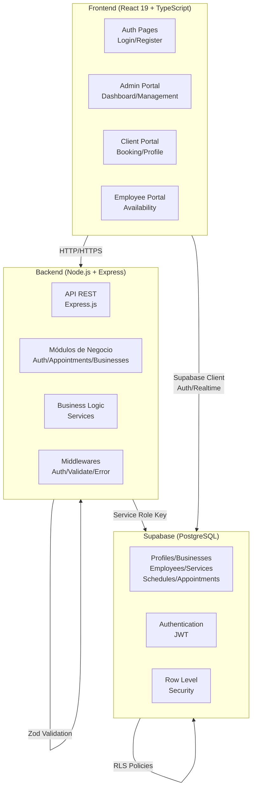

### Patrón Arquitectónico: Modular + Service-Oriented

```
Backend:
  src/
  ├── config/           # Configuraciones globales (supabase, env, logger)
  ├── middlewares/      # Middlewares Express (auth, validation, error handling)
  ├── modules/          # Módulos de negocio (cada uno es independiente)
  │   └── [módulo]/
  │       ├── [módulo].controller.js      # Orquestación HTTP
  │       ├── [módulo].service.js         # Lógica de negocio
  │       ├── [módulo].validation.js      # Esquemas Zod
  │       └── [módulo].routes.js          # Definición de rutas
  └── utils/            # Utilidades compartidas (error handling, responses)

Frontend:
  src/
  ├── components/       # Componentes React
  │   ├── ui/          # Componentes base (Button, Input, Card)
  │   ├── shared/      # Componentes compartidos (ProtectedRoute, Layouts)
  │   ├── appointments/ # Componentes de citas
  │   ├── notifications/# Componentes de notificaciones
  │   └── layout/      # Layouts principales
  ├── pages/           # Páginas (Auth, Dashboard, Client, Employee)
  ├── context/         # Context API (Auth, Business)
  ├── hooks/           # Hooks personalizados (useFetch, useUserRole)
  ├── services/        # Servicios de API (appointments.service.js)
  ├── config/          # Configuración (API, Supabase)
  └── utils/           # Utilidades (export, format)
```

---

## 🛠️ Stack Tecnológico

### Backend

| Capa | Tecnología | Función |
|------|-----------|---------|
| **Runtime** | Node.js 18+ | Entorno de ejecución |
| **Framework Web** | Express.js | Router HTTP y middlewares |
| **Base de Datos** | Supabase (PostgreSQL) | Almacenamiento + Auth + Storage |
| **Validación** | Zod | Validación de esquemas en runtime |
| **Seguridad** | Helmet + CORS | Headers seguros y CORS |
| **Logging** | Winston + Morgan | Registro centralizado |
| **Manejo de Archivos** | Multer | Procesamiento de uploads |
| **Documentación** | Swagger/OpenAPI | Documentación interactiva |

### Frontend

| Capa | Tecnología | Función |
|------|-----------|---------|
| **Librería UI** | React 19 | Componentes y estado |
| **Lenguaje** | TypeScript 6.0 | Tipado estático |
| **Build Tool** | Vite 8 | Bundler ultrarrápido |
| **Enrutamiento** | React Router 7 | SPA routing |
| **BD/Auth** | Supabase JS | Cliente para Supabase |
| **Iconos** | Lucide React | 1000+ iconos |
| **Notificaciones** | React Hot Toast | Toasts elegantes |
| **Utilidades de Fechas** | date-fns | Manipulación de fechas |
| **Exportación** | ExcelJS | Generación de Excel |

### Infraestructura

| Componente | Proveedor | Función |
|-----------|-----------|---------|
| **BD & Auth** | Supabase | PostgreSQL + Auth JWT + Storage |
| **RLS** | PostgreSQL | Seguridad a nivel de datos |
| **Deployment Frontend** | Vercel | Deploy automático (vercel.json) |
| **Deployment Backend** | A definir | Node.js server |

---

## 🗄️ Estructura de Base de Datos

### Diagrama E-R (Entidades Principales)

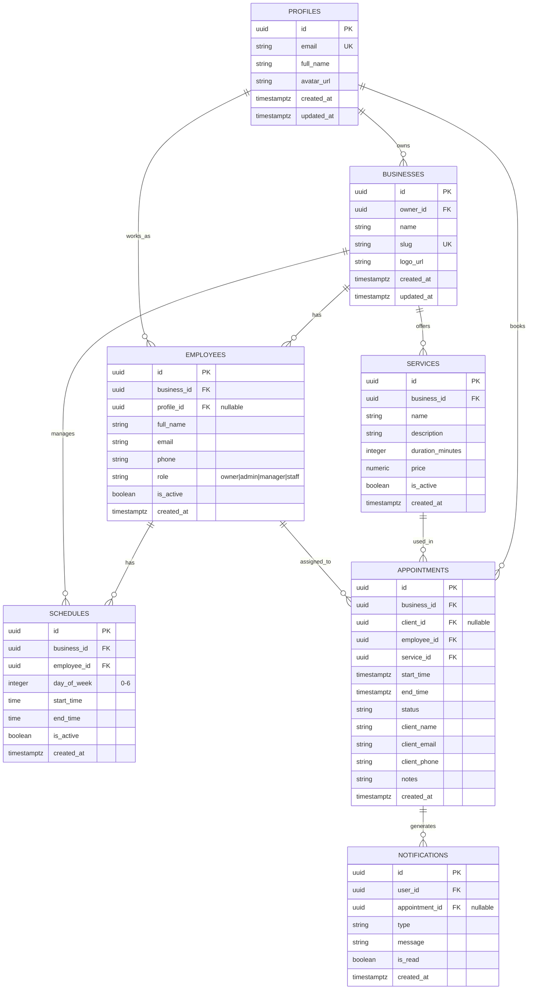

### Descripciones de Tablas

#### **profiles**
- **Propósito**: Almacenar datos de usuarios autenticados en Supabase Auth
- **Creación**: Automática via trigger cuando se registra un usuario en `auth.users`
- **Campos clave**: `id` (UUID, referencia a auth.users), `email`, `full_name`, `avatar_url`

#### **businesses**
- **Propósito**: Representa negocios/tenants en el sistema multi-tenant
- **Relación**: Un usuario (`profiles.id`) es `owner_id` de múltiples negocios
- **Slug**: URL-safe, único, usado en rutas públicas (ej: `/book/salon-belleza`)

#### **employees**
- **Propósito**: Gestión de staff dentro de cada negocio
- **Roles**: `owner` (propietario), `admin`, `manager`, `staff`
- **Especial**: `profile_id` puede ser NULL (empleados no registrados aún en Turnito)
- **Constraint**: Un perfil no puede ser duplicado en el mismo negocio

#### **services**
- **Propósito**: Catálogo de servicios que ofrece cada negocio
- **Campos clave**: `duration_minutes` (usado para calcular `end_time`), `price`, `is_active`
- **Multi-tenant**: Cada servicio pertenece a un negocio específico

#### **schedules**
- **Propósito**: Horarios laborales de empleados por día de la semana
- **day_of_week**: 0=Domingo, 6=Sábado (UTC)
- **Validación**: `end_time > start_time` en todos los casos

#### **appointments**
- **Propósito**: Reservas/turnos de clientes
- **Estados**: `pending`, `confirmed`, `cancelled`, `completed`, `no_show`
- **client_id**: Optional (permite checkout anónimo)
- **Validación**: Constraint EXCLUDE USING gist previene solapamientos de empleados

#### **notifications** (Sistema de notificaciones)
- **Propósito**: Registro de notificaciones para usuarios
- **Campos**: `user_id`, `appointment_id`, `type`, `message`, `is_read`

---

## 📡 Módulos del Backend

### 1. **auth** (Autenticación)

**Archivo**: `src/modules/auth/`

**Responsabilidad**: Gestión del ciclo de vida de autenticación (registro, login, logout)

#### Rutas

```http
POST   /auth/register          # Registra nuevo usuario o negocio
POST   /auth/login             # Inicia sesión
POST   /auth/logout            # Cierra sesión (invalida token)
```

#### Flujo de Registro

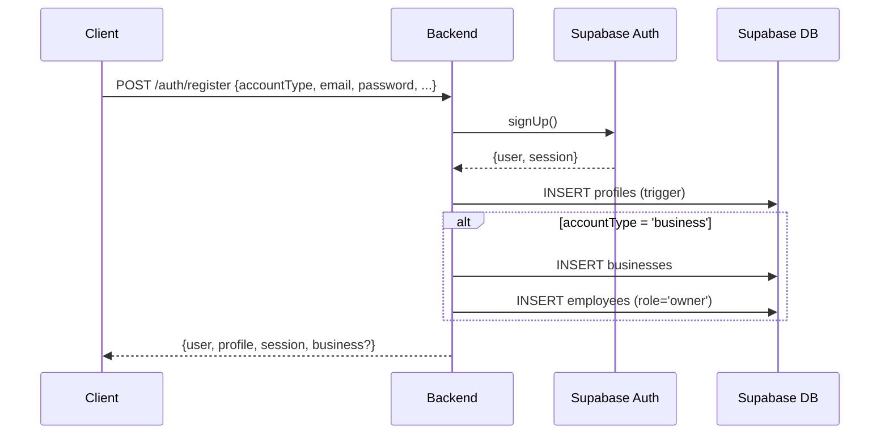

#### Validación Zod

```javascript
registerSchema:
  - email: email válido
  - password: mín 6 caracteres
  - fullName: mín 2 caracteres
  - accountType: 'client' | 'business' (default: 'client')
  - businessName: requerido si accountType='business'

loginSchema:
  - email: email válido
  - password: no vacío
```

#### Reglas de Negocio

1. **Dos tipos de cuenta**:
   - `client`: Solo crea `profiles` (sin negocios)
   - `business`: Crea `profiles` + `businesses` + `employees` (owner)

2. **Creación automática de perfil**: Trigger en `auth.users` → `profiles`

3. **JWT en sesión**: Supabase proporciona `access_token` + `refresh_token`

---

### 2. **users** (Perfiles de Usuario)

**Archivo**: `src/modules/users/`

**Responsabilidad**: Gestión de datos de usuario y roles

#### Rutas

```http
GET    /users/me               # Perfil del usuario autenticado + roles
PUT    /users/:id              # Actualizar datos del usuario
GET    /users/:id              # Obtener datos de un usuario específico
```

#### Datos Retornados en `/users/me`

```javascript
{
  user: { id, email },
  profile: { id, email, full_name, avatar_url },
  roles: {
    ownedBusinesses: [ { id, name, slug, ... } ],
    employeeRoles: [ { businessId, role, isActive, ... } ]
  }
}
```

---

### 3. **businesses** (Gestión de Negocios)

**Archivo**: `src/modules/businesses/`

**Responsabilidad**: CRUD de negocios (multi-tenant)

#### Rutas

```http
POST   /businesses              # Crear negocio (owner = usuario autenticado)
GET    /businesses              # Listar negocios (paginado)
GET    /businesses/:id          # Obtener detalles de un negocio
PUT    /businesses/:id          # Actualizar negocio (solo owner)
```

#### Parámetros

**Query Params** (GET /businesses):
- `page`: 1 (default)
- `limit`: 20 (default, max 100)
- `slug`: Filtrar por slug exacto (búsqueda de negocio único)

**Body** (POST /businesses):
```javascript
{
  name: string,
  slug: string (URL-safe),
  description?: string,
  phone?: string,
  address?: string,
  logo_url?: string
}
```

#### Reglas de Negocio

1. **Ownership**: Solo el owner puede actualizar su negocio
2. **Slug único**: Prevención de duplicados a nivel de validación y constraint de DB
3. **Multi-tenant**: Las operaciones se filtran por `business_id`

---

### 4. **employees** (Gestión de Empleados)

**Archivo**: `src/modules/employees/`

**Responsabilidad**: CRUD de empleados por negocio

#### Rutas

```http
POST   /employees                    # Crear empleado (owner del negocio)
GET    /employees/business/:id       # Listar empleados por negocio
PUT    /employees/:id?businessId=... # Actualizar empleado
DELETE /employees/:id?businessId=... # Eliminar empleado
```

#### Body (POST /employees)

```javascript
{
  business_id: UUID,
  full_name: string,
  email: string,
  phone?: string,
  role: 'owner' | 'admin' | 'manager' | 'staff' (default: 'staff'),
  is_active: boolean (default: true)
}
```

#### Reglas de Negocio

1. **Roles**: 4 niveles jerárquicos
   - `owner`: Propietario del negocio (creado automáticamente)
   - `admin`: Administrador (acceso completo)
   - `manager`: Gerente (acceso restringido)
   - `staff`: Empleado (acceso a citas propias)

2. **Constraint único**: No permite duplicar un perfil en el mismo negocio

3. **Cascade on delete**: Si el empleado se vincula a citas, el delete falla (RESTRICT)

---

### 5. **services** (Gestión de Servicios)

**Archivo**: `src/modules/services/`

**Responsabilidad**: Catálogo de servicios ofrecidos por cada negocio

#### Rutas

```http
POST   /services                     # Crear servicio
GET    /services/business/:id        # Listar servicios por negocio
PUT    /services/:id?businessId=...  # Actualizar servicio
DELETE /services/:id?businessId=...  # Eliminar (soft delete por defecto)
```

#### Body (POST /services)

```javascript
{
  business_id: UUID,
  name: string,
  description?: string,
  duration_minutes: integer (> 0),
  price: numeric(10,2),
  is_active: boolean (default: true)
}
```

#### Reglas de Negocio

1. **Soft delete**: Por defecto, `DELETE` marca como `is_active = false`
2. **Hard delete**: Query param `?hard=true` elimina el registro físicamente
3. **duration_minutes**: Esencial para calcular `end_time` en citas

---

### 6. **schedules** (Gestión de Horarios)

**Archivo**: `src/modules/schedules/`

**Responsabilidad**: Horarios laborales de empleados

#### Rutas

```http
POST   /schedules                    # Crear horario
GET    /schedules/business/:id       # Listar horarios por negocio
PUT    /schedules/:id?businessId=... # Actualizar horario
DELETE /schedules/:id?businessId=... # Eliminar horario
```

#### Body (POST /schedules)

```javascript
{
  business_id: UUID,
  employee_id: UUID,
  day_of_week: 0-6 (0=domingo),
  start_time: 'HH:MM:SS',
  end_time: 'HH:MM:SS',
  is_active: boolean (default: true)
}
```

#### Validaciones

1. **day_of_week**: Rango 0-6 (UTC)
2. **end_time > start_time**: Constraint CHECK
3. **Unicidad**: Un empleado no puede tener dos horarios superpuestos en el mismo día
4. **Solapamiento**: Si hay conflicto al actualizar, lanza error

#### Uso en Citas

Cuando se crea una cita, el backend verifica:
- `appointment.start_time` está dentro del `schedule` del empleado para ese día
- `appointment.end_time` también cae dentro del horario laboral

---

### 7. **appointments** (Gestión de Citas/Reservas)

**Archivo**: `src/modules/appointments/`

**Responsabilidad**: CRUD y validación compleja de citas

#### Rutas

```http
POST   /appointments                         # Crear cita (validación completa)
GET    /appointments/user                    # Citas del usuario autenticado
GET    /appointments/business/:id            # Citas de un negocio
PUT    /appointments/:id/status?businessId=.# Cambiar estado de cita
DELETE /appointments/:id?businessId=...      # Cancelar cita (soft delete)
```

#### Body (POST /appointments)

```javascript
{
  business_id: UUID,
  service_id: UUID,
  employee_id: UUID,
  start_time: 'ISO 8601' (ej: '2026-06-15T10:00:00Z'),
  client_name: string,
  client_email: email,
  client_phone?: string,
  notes?: string (max 500)
}
```

#### Estados de Cita

```
pending    → Cita creada, pendiente de confirmación
confirmed  → Confirmada por el negocio
completed  → Completada
cancelled  → Cancelada
no_show    → Cliente no se presentó
```

#### Validaciones Complejas (AppointmentService)

1. **No pasado**: `start_time` debe ser futuro
2. **Negocio activo**: El negocio debe existir
3. **Servicio activo**: El servicio debe existir y estar activo en ese negocio
4. **Empleado activo**: El empleado debe estar activo en ese negocio
5. **Cálculo de duración**: `end_time = start_time + service.duration_minutes`
6. **Dentro de horario**: start_time y end_time deben caer en `schedules` del empleado
7. **No solapamiento**: Otra cita del mismo empleado con estado ≠ 'cancelled' no puede ocupar ese slot
8. **Anti double-booking**: Prevención a nivel de constraint EXCLUDE USING gist
9. **Notificación automática**: Se crea registro en `notifications` al confirmar

#### Query Params (GET endpoints)

```
/appointments/user:
  - status: 'pending'|'confirmed'|'cancelled'|'completed'|'no_show'
  - page: 1
  - limit: 20 (max 100)

/appointments/business/:id:
  - status: (igual que arriba)
  - date: 'YYYY-MM-DD'
  - employee_id: UUID
  - page: 1
  - limit: 20
```

---

### 8. **notifications** (Sistema de Notificaciones)

**Archivo**: `src/modules/notifications/`

**Responsabilidad**: Gestión de notificaciones para usuarios

#### Rutas

```http
GET    /api/notifications              # Obtener notificaciones (paginado)
GET    /api/notifications/unread/count # Contador de no leídas
PUT    /api/notifications/:id/read     # Marcar como leída
PUT    /api/notifications/mark-all     # Marcar múltiples como leídas
DELETE /api/notifications/:id          # Eliminar notificación
```

#### Datos Devueltos

```javascript
{
  data: [
    {
      id: UUID,
      user_id: UUID,
      appointment_id: UUID,
      type: string,
      message: string,
      is_read: boolean,
      created_at: timestamptz
    }
  ],
  total: number,
  page: number,
  limit: number
}
```

#### Generación de Notificaciones

- **Automática** cuando se crea una cita (tipo: appointment_created)
- **En cambios de estado** (confirmada, completada, cancelada)
- **Recordatorios** (si está implementado)

---

### 9. **uploads** (Manejo de Archivos)

**Archivo**: `src/modules/uploads/`

**Responsabilidad**: Subida y gestión de archivos (actualmente básico)

#### Rutas

```http
POST   /uploads      # Subir archivo (multer middleware)
```

#### Middleware Multer

Configurado en `src/middlewares/upload.js` para:
- Validar tipos de archivo
- Limitar tamaño
- Almacenar en Supabase Storage

---

## 🎨 Frontend: Estructura y Componentes

### Estructura de Carpetas

```
frontend/src/
├── components/
│   ├── ui/                     # Componentes base reutilizables
│   │   ├── Button.jsx
│   │   ├── Input.jsx
│   │   ├── Card.jsx
│   │   ├── Badge.jsx
│   │   ├── Spinner.jsx
│   │   ├── ErrorModal.jsx
│   │   └── ... otros
│   ├── shared/                 # Componentes de lógica compartida
│   │   ├── ProtectedRoute.jsx              # Guard: requiere autenticación
│   │   ├── ProtectedAdminRoute.jsx         # Guard: requiere admin
│   │   ├── ProtectedEmployeeRoute.jsx      # Guard: requiere employee
│   │   ├── ProtectedClientRoute.jsx        # Guard: requiere client
│   │   └── SmartRedirect.jsx               # Redirige según rol
│   ├── layout/
│   │   ├── AuthLayout.jsx                  # Layout para login/register
│   │   ├── DashboardLayout.jsx             # Layout para admin portal
│   │   ├── ClientLayout.jsx                # Layout para client portal
│   │   ├── Sidebar.jsx
│   │   ├── TopBar.jsx
│   │   └── ... otros
│   ├── appointments/           # Componentes de citas
│   │   └── ... (detalles de citas, listados)
│   ├── notifications/          # Componentes de notificaciones
│   │   └── ... (campana, listado)
│   └── ...
├── pages/
│   ├── auth/
│   │   ├── LoginPage.jsx
│   │   └── RegisterPage.jsx        # Flujo multi-step: tipo cuenta → datos
│   ├── dashboard/               # Admin portal
│   │   ├── AdminDashboard.jsx      # Resumen con métricas
│   │   ├── AppointmentsPage.jsx
│   │   ├── EmployeesPage.jsx
│   │   ├── ServicesPage.jsx
│   │   ├── SchedulesPage.jsx
│   │   ├── BusinessesPage.jsx      # Listar negocios
│   │   ├── CreateBusinessPage.jsx
│   │   └── ProfilePage.jsx
│   ├── client/
│   │   ├── BookingPage.jsx         # Flujo multi-step de reserva
│   │   ├── MyAppointmentsPage.jsx
│   │   ├── BusinessesPage.jsx      # Listar negocios disponibles
│   │   ├── ClientDashboard.jsx
│   │   ├── ProfilePage.jsx
│   │   └── booking/                # Sub-componentes del booking
│   │       ├── BookingStepper.jsx
│   │       ├── StepService.jsx
│   │       ├── StepEmployee.jsx
│   │       ├── StepDateTime.jsx
│   │       ├── StepClientData.jsx
│   │       └── StepConfirm.jsx
│   ├── employee/
│   │   └── EmployeeDashboard.jsx   # Portal de empleado
│   └── NotFoundPage.jsx
├── context/
│   ├── AuthContext.jsx             # Estado global: user, profile, sesión
│   └── BusinessContext.jsx         # Estado global: negocio activo, roles
├── hooks/
│   ├── useFetch.js                 # Hook genérico para GET
│   ├── useForm.js                  # Hook para manejo de formularios
│   ├── useUserRole.js              # Derivar rol del usuario
│   ├── useAppointments.js          # Lógica de citas
│   ├── useNotifications.js         # Lógica de notificaciones
│   └── useErrorModal.js            # Manejo de modales de error
├── services/
│   ├── appointments.service.js     # Servicios de API para citas
│   └── uploads.service.js
├── config/
│   ├── api.js                      # Configuración de axios/fetch
│   └── supabase.js                 # Cliente Supabase (auth+realtime)
├── utils/
│   └── exportAppointments.js       # Exportar a Excel
└── styles/
    ├── index.css                   # Paleta de colores y variables CSS
    ├── components.css              # Sistema de componentes
    └── ...
```

### Sistema de Rutas (React Router)

```javascript
/                          → SmartRedirect (redirige según rol)
/login                     → LoginPage
/register                  → RegisterPage (multi-step)

/dashboard/                → DashboardLayout (admin portal)
  /dashboard/overview      → AdminDashboard
  /dashboard/appointments  → AppointmentsPage
  /dashboard/employees     → EmployeesPage
  /dashboard/services      → ServicesPage
  /dashboard/schedules     → SchedulesPage
  /dashboard/businesses    → BusinessesPage
  /dashboard/create-business → CreateBusinessPage
  /dashboard/settings      → BusinessSettingsPage
  /dashboard/profile       → ProfilePage

/client/                   → ClientLayout (client portal)
  /client/dashboard        → ClientDashboard
  /client/appointments     → MyAppointmentsPage
  /client/businesses       → ClientBusinessesPage
  /client/profile          → UserProfilePage
  /client/book/:businessSlug → BookingPage (multi-step)

/employee/                 → EmployeeDashboard

/book/:businessSlug        → Redirige a /client/book/:businessSlug

* → NotFoundPage
```

### Contextos (Context API)

#### **AuthContext**
```javascript
{
  user,                    // auth.users (de Supabase)
  profile,                 // profiles row
  session,                 // JWT tokens
  isAuthenticated,         // boolean
  loading,                 // boolean
  login(),                 // función
  register(),              // función
  registerBusiness(),      // función
  logout()                 // función
}
```

#### **BusinessContext**
```javascript
{
  activeBusiness,          // Negocio seleccionado actualmente
  ownedBusinesses,         // Negocios que posee el usuario
  employeeRoles,           // Roles del usuario como empleado
  loading,                 // boolean
  isOwner,                 // ¿Es propietario del negocio activo?
  switchBusiness(),        // Cambiar negocio activo
  refreshBusinessData(),   // Refrescar datos
  hasBusinesses            // ¿Tiene algún negocio o es empleado?
}
```

### Hooks Personalizados

#### **useFetch(endpoint, options)**
```javascript
// Fetch genérico con estados
const { data, loading, error, refetch, setData } = useFetch('/users/me')

Options:
  - immediate: true/false (fetch al montar)
  - onSuccess: callback
  - onError: callback
```

#### **useForm(initialValues, onSubmit)**
Manejo de formularios con validación

#### **useUserRole()**
```javascript
// Deriva rol del usuario desde BusinessContext
const { isAdmin, isEmployee, isClient } = useUserRole()
```

#### **useAppointments(businessId)**
Lógica de citas (cargar, crear, actualizar)

#### **useNotifications()**
Lógica de notificaciones (cargar, marcar como leída)

#### **useErrorModal()**
Manejo de modales de error globales

### Guard Routes (ProtectedRoute)

```javascript
<ProtectedRoute>          {/* Requiere autenticación */}
<ProtectedAdminRoute>     {/* Requiere admin */}
<ProtectedEmployeeRoute>  {/* Requiere employee */}
<ProtectedClientRoute>    {/* Requiere client */}
```

---

## 🔐 Flujo de Autenticación

### 1. Registro de Cuenta Cliente

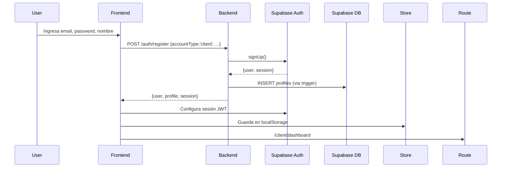

### 2. Registro de Negocio

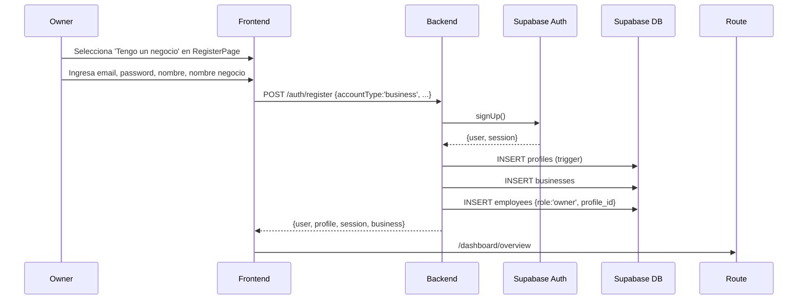

### 3. Login

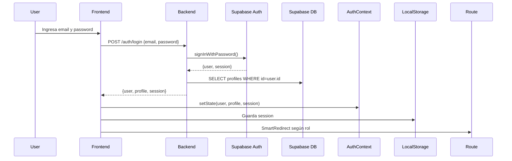

### 4. Validación de Token (Middleware Backend)

```javascript
// Middleware: requireAuth
GET request con Authorization: Bearer <token>
  ↓
Backend extrae token del header
  ↓
Llama supabase.auth.getUser(token)
  ↓
Valida JWT contra Supabase
  ↓
req.user = { id, email, ... }
  ↓
next()
```

### 5. Logout

```javascript
// Frontend
POST /auth/logout
  ↓
Backend invalida token (registro en DB)
  ↓
Frontend limpia localStorage
  ↓
Frontend redirige a /login
```

---

## 🗓️ Flujo de Reserva de Citas

### Contexto Actual

El flujo de reserva está **completamente implementado** en el frontend (BookingPage) con 5 pasos multi-step, pero el **backend está listo para procesar**.

### Pasos de Booking (Frontend)

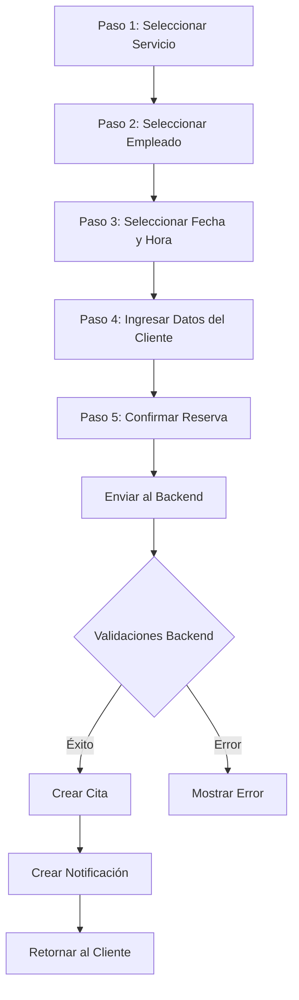

### Componentes Frontend (BookingPage)

```javascript
BookingPage (contenedor principal)
├── BookingStepper (UI: progreso de pasos)
├── StepService (seleccionar servicio)
├── StepEmployee (seleccionar empleado)
├── StepDateTime (fecha/hora con calendario)
├── StepClientData (email, teléfono, notas)
└── StepConfirm (revisión antes de confirmar)
```

### Lógica de BookingPage

```javascript
useParams() → { businessSlug }
  ↓
Fetch /businesses?slug=X → obtener business.id
  ↓
Fetch /services/business/:id → servicios activos
  ↓
Fetch /employees/business/:id → empleados activos
  ↓
User selecciona servicio, empleado, fecha/hora
  ↓
Backend valida en POST /appointments:
  1. Negocio activo ✓
  2. Servicio activo ✓
  3. Empleado activo ✓
  4. start_time futuro ✓
  5. end_time = start_time + duration_minutes
  6. Dentro de horario laboral ✓
  7. Sin solapamiento ✓
  ↓
POST /appointments { business_id, service_id, employee_id, start_time, client_name, client_email, ... }
  ↓
200 OK → Cita creada
  ↓
Frontend: toast success, redirige a /client/appointments
```

### Validaciones Backend (AppointmentService)

Cuando se POST a `/appointments`:

```javascript
1. Verificar que start_time no sea en el pasado
2. Verificar que el negocio existe y está activo
3. Verificar que el servicio existe, está activo y pertenece al negocio
4. Verificar que el empleado existe, está activo y pertenece al negocio
5. Calcular end_time = start_time + service.duration_minutes
6. Verificar que start_time y end_time caen dentro del horario laboral del empleado
7. Verificar que no existe otra cita del empleado en ese rango (anti-solapamiento)
8. Crear cita con status='pending'
9. Crear notificación automáticamente
10. Log de evento
```

### Detalles Técnicos

#### Cálculo de `end_time`
```javascript
start_time: '2026-06-15T10:00:00Z'
service.duration_minutes: 30
end_time: '2026-06-15T10:30:00Z'
```

#### Verificación de Horario Laboral
```javascript
// Usando schedules del empleado para el día de la semana de start_time
const dayOfWeek = startDate.getUTCDay() // 0-6
const schedules = DB.schedules 
  .where(employee_id, day_of_week)
  .where(is_active = true)

// Verificar: startTime >= schedule.start_time AND endTime <= schedule.end_time
```

#### Anti-Solapamiento
```javascript
// Constraint en DB:
EXCLUDE USING gist (
  employee_id WITH =,
  TSRANGE(start_time, end_time) WITH &&
) WHERE status != 'cancelled'

// También hay índice:
idx_appointments_employee_overlap
  ON (employee_id, start_time, end_time)
  WHERE status != 'cancelled'
```

---

## 👥 Gestión de Negocios y Equipos

### Creación de Negocio

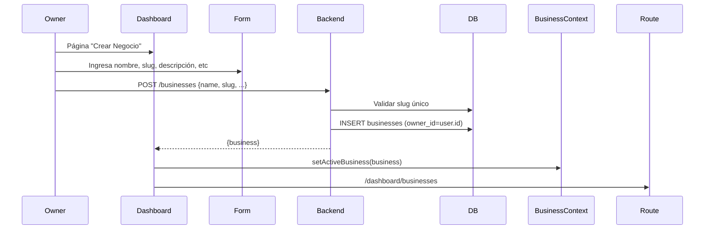

### Gestión de Empleados

```javascript
// Admin puede crear empleados en su negocio
POST /employees {
  business_id,
  full_name,
  email,
  role: 'owner'|'admin'|'manager'|'staff',
  is_active: true
}

// Backend verifica ownership del negocio
// Crea registro en employees table
// profile_id puede ser NULL si el empleado no se ha registrado aún
```

### Roles y Permisos (Ver sección dedicada abajo)

---

## 🔔 Sistema de Notificaciones

### Arquitectura

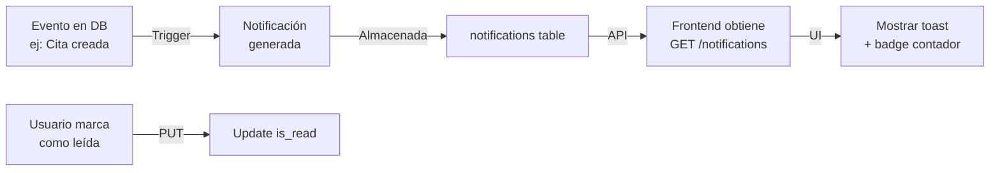

### Rutas Disponibles

```http
GET    /api/notifications              # Obtener notificaciones paginadas
GET    /api/notifications/unread/count # Contar no leídas
PUT    /api/notifications/:id/read     # Marcar como leída
PUT    /api/notifications/mark-all     # Marcar múltiples como leídas
DELETE /api/notifications/:id          # Eliminar notificación
```

### Generación de Notificaciones

**Actualmente se crean al confirmar cita:**

```javascript
// En appointment.service.js cuando status='confirmed'
await supabase.from('notifications').insert({
  user_id: client_id,
  appointment_id: appointment.id,
  type: 'appointment_confirmed',
  message: 'Tu cita ha sido confirmada',
  is_read: false
})
```

### Frontend: Mostrar Notificaciones

```javascript
// useNotifications hook
const { notifications, unreadCount, markAsRead } = useNotifications()

// TopBar muestra ícono con badge
<Badge count={unreadCount} />

// Dropdown con notificaciones recientes
// Click en notificación marca como leída
```

---

## 🔐 Seguridad y Autorización

### Niveles de Seguridad

#### 1. **Nivel 1: Autenticación (JWT)**
```javascript
// Backend: Middleware requireAuth
Authorization: Bearer <token>
  ↓
Validar token con Supabase.auth.getUser()
  ↓
Adjuntar req.user
```

#### 2. **Nivel 2: Autorización por Rol (Backend)**
```javascript
// Middleware: requireRole(['admin', 'manager'])
Verificar que req.user pertenece a algún negocio
  ↓
Verificar que su role está en allowedRoles
  ↓
if NOT → 403 Forbidden
```

#### 3. **Nivel 3: Row Level Security (RLS) - PostgreSQL**
```sql
-- Las políticas RLS garantizan que:
-- - Un usuario solo puede leer sus propios datos
-- - Un admin solo puede ver datos de sus negocios
-- - Un empleado solo puede ver citas de su empleador
```

#### 4. **Nivel 4: Validación de Datos (Zod)**
```javascript
// Todos los payloads se validan con Zod ANTES de procesarlos
POST /appointments {
  business_id: z.string().uuid(),
  service_id: z.string().uuid(),
  start_time: z.string().datetime(),
  // ... etc
}
```

### Patrones de Seguridad Implementados

#### **Multi-tenant Isolation**

```javascript
// Cada operación filtra por business_id
const appointments = await db
  .from('appointments')
  .select()
  .eq('business_id', businessId)  // ← CRUCIAL

// Middleware valida ownership:
requireRole(['owner', 'admin']) // Solo acceso si eres owner/admin del negocio
```

#### **Ownership Validation**

```javascript
// Verificar que el usuario es propietario del negocio
const business = await db.from('businesses')
  .select('owner_id')
  .eq('id', businessId)
  .single()

if (business.owner_id !== req.user.id) {
  throw ApiError.forbidden('No tienes permiso para esta operación')
}
```

#### **Soft Delete (Logical Delete)**

```javascript
// Servicios y citas no se borran físicamente
DELETE /services/:id
  ↓
UPDATE services SET is_active = false WHERE id = :id

// Datos históricos se conservan para auditoría
```

#### **No DELETE Físico en Citas**

```sql
-- Política RLS bloquea DELETE directo en appointments
DROP POLICY IF EXISTS "Bloquear eliminacion fisica de citas" ON public.appointments;
CREATE POLICY "Bloquear eliminacion fisica de citas"
  ON public.appointments FOR DELETE
  TO authenticated
  USING (false);  -- Nadie puede hacer DELETE

-- La cancelación es via UPDATE status = 'cancelled'
```

### Configuración de Helmet (Headers Seguros)

```javascript
// src/app.js
app.use(helmet())

// Configura automáticamente:
// - Content-Security-Policy
// - X-Frame-Options: DENY
// - X-Content-Type-Options: nosniff
// - Strict-Transport-Security
// - etc.
```

### CORS (Control de Origen)

```javascript
// src/config/cors.js
const corsOptions = {
  origin: process.env.CORS_ORIGIN.split(','),
  credentials: true
}

app.use(cors(corsOptions))
```

---

## 👤 Roles y Permisos

### Jerarquía de Roles

```
System
├── Admin (No implementado globalmente, es por negocio)
│
└── Negocios (Multi-tenant)
    ├── Owner
    │   └── Permisos: Crear/leer/actualizar/eliminar todo del negocio
    │
    ├── Admin (del negocio)
    │   └── Permisos: Similar al owner pero sin poder eliminar empleados
    │
    ├── Manager
    │   └── Permisos: Leer citas, empleados. Actualizar estado de citas
    │
    ├── Staff
    │   └── Permisos: Leer citas propias. Ver horarios.
    │
    └── Client
        └── Permisos: Hacer reservas. Ver citas propias.
```

### Mapeo de Permisos por Endpoint

| Endpoint | Client | Staff | Manager | Admin | Owner |
|----------|--------|-------|---------|-------|-------|
| POST /appointments | ✓ | - | - | - | - |
| GET /appointments/user | ✓ | ✓ | ✓ | ✓ | ✓ |
| GET /appointments/business/:id | - | ✓ | ✓ | ✓ | ✓ |
| PUT /appointments/:id/status | - | - | ✓ | ✓ | ✓ |
| POST /businesses | ✓ (crear propio) | - | - | - | - |
| GET /businesses | ✓ | - | - | - | - |
| PUT /businesses/:id | - | - | - | - | ✓ |
| POST /employees | - | - | - | ✓ | ✓ |
| GET /employees/business/:id | - | ✓ | ✓ | ✓ | ✓ |
| POST /services | - | - | - | ✓ | ✓ |
| GET /services/business/:id | ✓ | ✓ | ✓ | ✓ | ✓ |
| POST /schedules | - | - | - | ✓ | ✓ |

### Derivación de Rol en Frontend

```javascript
// useUserRole.js
const { ownedBusinesses, employeeRoles } = useBusiness()

// Admin si:
//   - Posee negocios (ownedBusinesses.length > 0) O
//   - Es empleado con role 'owner' o 'admin' y está activo

// Employee si:
//   - NO es admin Y
//   - Es empleado con role 'staff' o 'manager' y está activo

// Client si:
//   - NO es admin y NO es employee
```

---

## 🔗 Integración Frontend-Backend-Supabase

### Flujo de Datos General

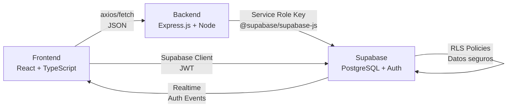

### Cliente HTTP (Frontend)

```javascript
// frontend/src/config/api.js
import axios from 'axios'
import { supabase } from './supabase'

const api = axios.create({
  baseURL: process.env.REACT_APP_API_URL || 'http://localhost:3000/api'
})

// Interceptor: Agregar token JWT a cada request
api.interceptors.request.use((config) => {
  const session = supabase.auth.session()
  if (session?.access_token) {
    config.headers.Authorization = `Bearer ${session.access_token}`
  }
  return config
})

export default api
```

### Cliente Supabase (Frontend)

```javascript
// frontend/src/config/supabase.js
import { createClient } from '@supabase/supabase-js'

export const supabase = createClient(
  process.env.REACT_APP_SUPABASE_URL,
  process.env.REACT_APP_SUPABASE_ANON_KEY  // Anon key (public)
)

// Se usa para:
// - Auth (signUp, signIn, signOut)
// - Realtime (escuchar cambios)
// - Storage (subir archivos)
// - Queries RLS-protegidas
```

### Cliente Supabase (Backend)

```javascript
// src/config/supabase.js
import { createClient } from '@supabase/supabase-js'

export const supabase = createClient(
  env.SUPABASE_URL,
  env.SUPABASE_SERVICE_ROLE_KEY  // Service role key (admin/backend)
)

// Se usa para:
// - Todas las operaciones de BD
// - Bypass de RLS (cuando es necesario)
// - Operaciones administrativas
```

### Flujo de Creación de Cita (End-to-End)

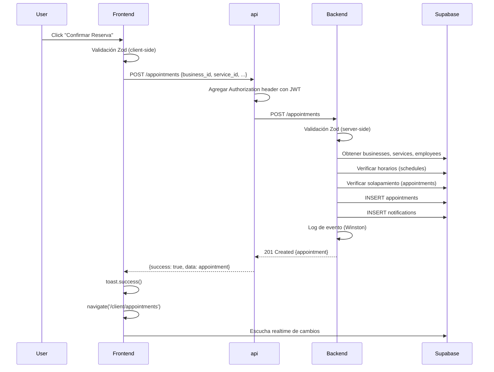

### Componentes Clave de Integración

#### **AuthContext + Supabase**
```javascript
// Sincroniza estado de Supabase Auth con Context
supabase.auth.onAuthStateChange((event, session) => {
  setSession(session)
  setUser(session?.user ?? null)
})

// Persiste sesión en localStorage
// Hidrata al cargar la app
```

#### **BusinessContext + API Backend**
```javascript
// Carga negocios y roles desde:
// GET /users/me → {roles: {ownedBusinesses, employeeRoles}}

useEffect(() => {
  if (isAuthenticated) {
    api.get('/users/me').then(response => {
      setOwnedBusinesses(response.data.roles.ownedBusinesses)
      setEmployeeRoles(response.data.roles.employeeRoles)
    })
  }
}, [isAuthenticated])
```

#### **useFetch + API Interceptor**
```javascript
// Hook genérico para GET
const { data, loading, error } = useFetch('/businesses')

// Internamente:
// 1. Obtiene session de Supabase
// 2. Agrega token al header
// 3. Hace fetch con axios
// 4. Maneja errores
// 5. Retorna {data, loading, error}
```

---

## 🚀 Deployment y Configuración

### Configuración de Entorno (Backend)

**`.env.example`:**
```bash
# Base de datos
SUPABASE_URL=https://xxxx.supabase.co
SUPABASE_SERVICE_ROLE_KEY=eyJhbGciOi...

# Servidor
PORT=3000
NODE_ENV=development

# CORS
CORS_ORIGIN=http://localhost:5173,http://localhost:3000

# Logging
LOG_LEVEL=info
```

### Variables de Entorno (Frontend)

**`.env` (Vite):**
```bash
VITE_SUPABASE_URL=https://xxxx.supabase.co
VITE_SUPABASE_ANON_KEY=eyJhbGciOi...
VITE_API_URL=http://localhost:3000/api
```

### Scripts de Ejecución

**Backend:**
```bash
# Desarrollo (con nodemon)
npm run dev

# Producción
npm start
```

**Frontend:**
```bash
# Desarrollo (Vite)
npm run dev

# Build
npm run build

# Preview
npm run preview
```

### Deployment Vercel (Frontend)

**`frontend/vercel.json`:**
```json
{
  "buildCommand": "npm run build",
  "outputDirectory": "dist"
}
```

Deployment automático: Push a GitHub → Vercel CI/CD

### Migraciones de Base de Datos

Se encuentran en `supabase/migrations/` en orden cronológico:

```
20260603120000_init_schema.sql          # Inicialización: todas las tablas
20260604000000_extend_businesses.sql    # Extensiones de businesses
20260604010000_extend_employees.sql     # Extensiones de employees
20260604020000_extend_services.sql      # Extensiones de services
20260604030000_extend_schedules.sql     # Extensiones de schedules
20260611000000_appointments_module.sql  # Módulo appointments + RLS
20260705_create_notifications.sql       # Sistema de notificaciones
20260705000000_make_employee_id_nullable.sql # Permitir employees sin perfil
```

Aplicar migraciones:
```bash
supabase migration up
```

---

## 📊 Diagramas Adicionales

### Estado de Cita (FSM)

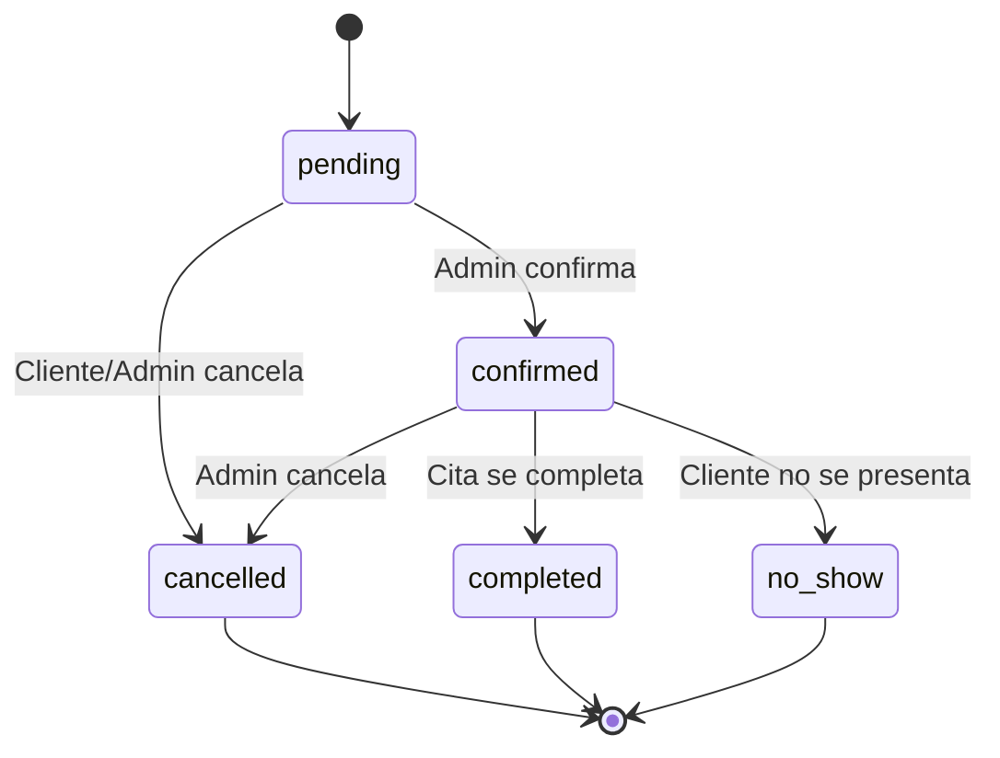

### Flujo de Login

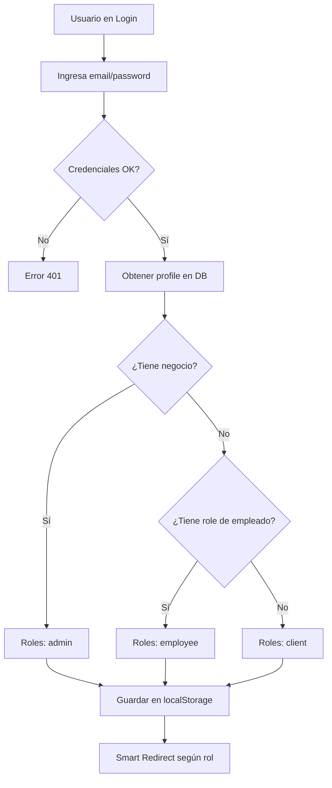

### Ciclo de Vida de Cita

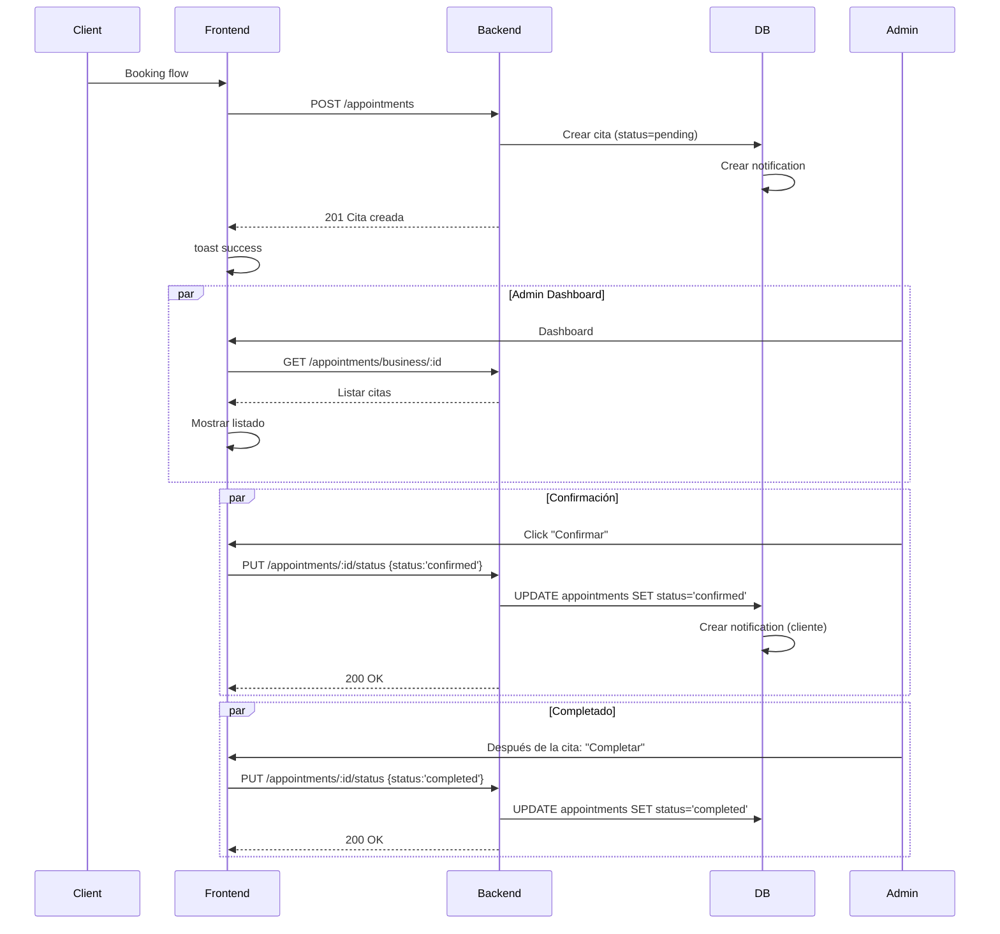

---

## 📝 Notas de Implementación

### Lo que NO Existe (No inventado)

- ❌ **Sistema de pagos**: No hay Stripe o similares integrado
- ❌ **Email/SMS automáticos**: Sistema de notificaciones está en DB, UI pendiente
- ❌ **Disponibilidad en tiempo real**: No hay WebSocket, polling opcional
- ❌ **Cancelación automática de citas**: Requiere job scheduler (cron)
- ❌ **Sistema de reseñas**: No implementado
- ❌ **Chat/Mensajería**: No existe
- ❌ **Multi-idioma i18n**: Codificado en español
- ❌ **Dark mode**: No implementado

### Lo que SÍ Existe

- ✅ **Autenticación JWT**: Supabase Auth completo
- ✅ **Multi-tenant**: Cada negocio es independiente
- ✅ **Validación Zod**: Entrada y salida validadas
- ✅ **RLS**: Seguridad a nivel de BD
- ✅ **Logging**: Winston + Morgan
- ✅ **Manejo de errores**: Centralizado con middleware
- ✅ **Paginación**: En endpoints de listado
- ✅ **Soft delete**: Para servicios y citas
- ✅ **Anti-solapamiento**: Constraint y lógica de validación
- ✅ **Roles y permisos**: 4 roles principales
- ✅ **Exportación Excel**: appointmentsService.getAllByBusiness()
- ✅ **Sistema de notificaciones**: BD y API lista
- ✅ **Guards de ruta**: ProtectedRoute, ProtectedAdminRoute, etc

---

## 🎯 Conclusión

Turnito es una **plataforma SaaS completa y lista para producción** con:

1. **Arquitectura robusta**: Modular, escalable, multi-tenant
2. **Seguridad multinivel**: Autenticación, autorización, RLS, validación
3. **Stack moderno**: React 19, TypeScript, Node.js, PostgreSQL
4. **Documentación clara**: Código comentado, migraciones versionadas
5. **Validación integral**: Zod server-side y client-side

El proyecto está estructurado para facilitar el crecimiento futuro: agregar nuevos módulos es tan simple como replicar el patrón de `modules/[nombre]` con sus 4 archivos (controller, service, validation, routes).

---

**Fin del Documento Técnico**
